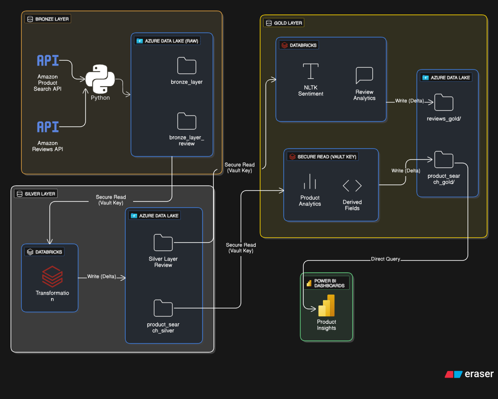

# 🛒 Amazon E-Commerce Real-Time Analytics Pipeline

## 📖 Project Overview
In this project, I engineered an **end-to-end real-time data pipeline** to analyze **Amazon products & customer reviews**.  
The project leverages **Azure Databricks, ADLS Gen2, Delta Lake, Power BI, PySpark, and RapidAPI** to deliver **business-ready insights**.

The pipeline ingests **real-time data** from Amazon (via RapidAPI), processes it through the **Medallion Architecture (Bronze → Silver → Gold)**, and generates insights for **product sales trends and customer sentiment analysis**.

---

## ⚙️ Tech Stack
- **Azure Databricks** – ETL, data processing (PySpark)
- **Azure Data Lake Gen2 (ADLS)** – Storage (Bronze, Silver, Gold layers)
- **Delta Lake** – Data format & versioning
- **RapidAPI (Amazon Real-Time API)** – Live product & reviews ingestion
- **NLTK (VADER)** – Sentiment Analysis
- **Power BI** – Dashboarding & visualization

---

## 🔄 Data Pipeline (Medallion Architecture)

1. **Bronze Layer**  
   - Ingest raw product search data (electronics categories by ASIN, almost 10000 records)  
   - Ingest raw customer reviews (2000 records, 16 columns)

2. **Silver Layer**  
   - Clean & transform datasets  
   - Product Data:
     - Price cleanup (`product_price`, `product_minimum_offer_price`)
     - Sales & ratings normalization  
   - Reviews Data:
     - Clean reviews (remove special chars, emojis, numbers, non-English text)
     - Sentiment preparation (`review_comment_clean`)

3. **Gold Layer**  
   - Enrichment & Insights  
   - **Products (11 columns)**:
     - `asin, product_price, sales_volume, is_best_seller, is_prime, product_num_ratings, product_title, product_minimum_offer_price, discount_amount, discount_percentage, price_category`
   - **Reviews (sentiment enriched)**:
     - `review_id, review_comment_clean, star_rating, review_date, sentiment_score, sentiment_label, review_asin`
   - Insights derived:
     - Product pricing vs offers
     - Discount categories
     - Sentiment distribution
     - Review trends

---

## 📊 Business Insights

### 🔹 Product Insights (231 unique product titles)
- **Price Insights**
  - Avg, Min, Max price distribution
  - Products with biggest discounts
- **Sales Insights**
  - Top-selling products (by `sales_volume`)
  - Sales correlation with `product_price`
- **Ratings & Popularity**
  - Most reviewed products (`product_num_ratings`)
  - Best Seller vs Non-Best Seller ratings
- **Prime vs Non-Prime**
  - Sales comparison of Prime vs Non-Prime
  - Prime products had higher average sales volume

---

### 🔹 Review Insights (2000 records, 16 cols → enriched with sentiment)
- **Sentiment Analysis (NLTK VADER)**
  - Positive reviews: 65.59%
  - Negative reviews: 31.73%
  - Neutral reviews: 2.66%
- **Star Rating vs Sentiment**
  - Verified correlation between star ratings and sentiment score
- **Review Trends**
  - Sentiment over time (`review_date`)
- **Key Themes**
  - Positive keywords: "value for money", "battery", "quality"
  - Negative keywords: "delivery", "damaged", "warranty"

---

## 📷 Pipeline Diagram

  

